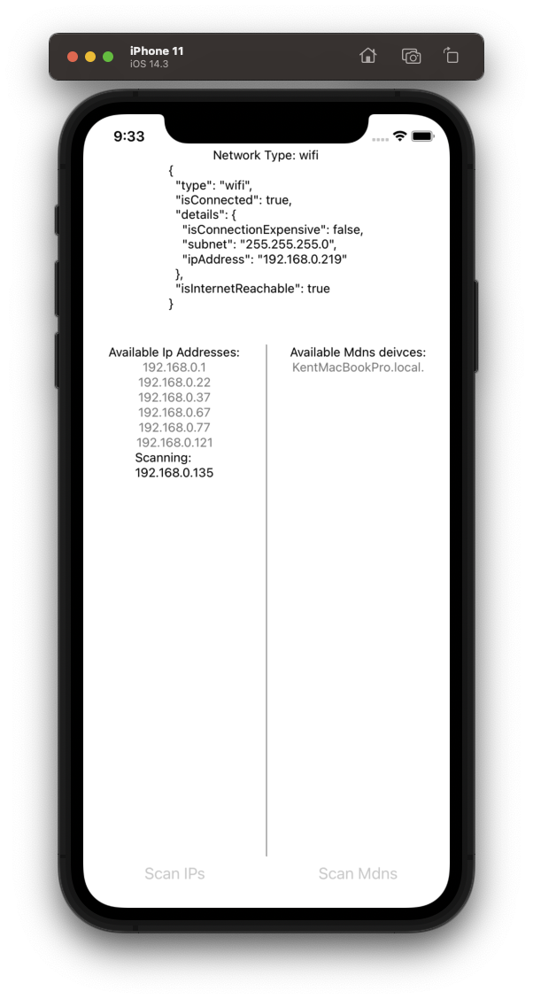

# poc-discover-network-device-app

The app is a PoC of try to get devices that in the same network.



## Usage

- start the app
```
$ yarn && cd ios && pod install
$ yarn run ios
```

- start mdns server

```
$ node server.js
```
